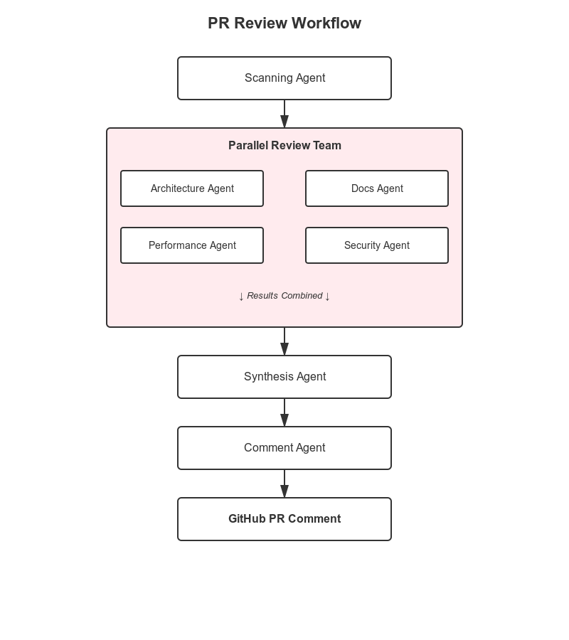
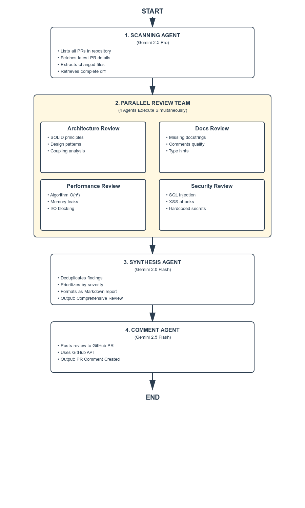

# 🤖 Automated GitHub PR Review System with Multi-Agent Architecture

## Overview

This project implements an intelligent, multi-agent code review system that automatically analyzes GitHub Pull Requests using Google's Gemini models and the Agent Development Kit (ADK). The system employs a sophisticated orchestration of specialized AI agents, each focusing on different aspects of code quality.

## 🎯 Problem Statement

Manual code reviews are:
- **Time-consuming**: Developers spend hours reviewing PRs
- **Inconsistent**: Quality depends on reviewer expertise and availability
- **Prone to human error**: Easy to miss critical issues
- **Bottleneck**: Slows down development velocity

This system automates comprehensive code reviews across multiple dimensions: security, performance, documentation, and architecture.

## 🏗️ System Architecture

### High-Level Architecture



### Agent Flow Diagram




## 🔧 Technical Implementation

### 1. Agent Orchestration

The system uses two orchestration patterns:

**Sequential Agent** (Root):
```python
root_agent = SequentialAgent(
    name="ReviewSystem",
    sub_agents=[
        scanning_agent, 
        parallel_code_review_team,
        synthesis_agent,
        comment_agent
    ],
)
```

**Parallel Agent** (Review Team):
```python
parallel_code_review_team = ParallelAgent(
    name="ParallelCodeReviewTeam",
    sub_agents=[
        architecture_agent, 
        docs_agent, 
        performance_agent,
        security_agent
    ],
)
```

### 2. Specialized Agents

#### 🔍 Scanning Agent
- **Model**: Gemini 2.5 Pro
- **Purpose**: PR data extraction
- **Tools**: GitHub MCP (Model Context Protocol)
- **Output**: Structured `GithubPR` schema

#### 🏛️ Architecture Agent
- **Model**: Gemini 2.0 Flash
- **Focus**: 
  - SOLID principles
  - Design patterns
  - Modularization & coupling
  - Scalability concerns

#### 📚 Documentation Agent
- **Model**: Gemini 2.0 Flash
- **Focus**:
  - Missing docstrings
  - Comment quality
  - Type hints
  - README updates

#### ⚡ Performance Agent
- **Model**: Gemini 2.0 Flash
- **Focus**:
  - Algorithm efficiency
  - N+1 queries
  - Memory leaks
  - Blocking I/O

#### 🔒 Security Agent
- **Model**: Gemini 2.0 Flash
- **Focus**:
  - Injection vulnerabilities
  - Hardcoded secrets
  - Authentication issues
  - Data exposure

#### 🔄 Synthesis Agent
- **Model**: Gemini 2.0 Flash
- **Purpose**: Aggregate and format findings
- **Actions**:
  - Deduplication
  - Priority sorting
  - Markdown formatting

#### 💬 Comment Agent
- **Model**: Gemini 2.5 Flash
- **Purpose**: Post review to GitHub
- **Tool**: `add_pr_comment` function

### 3. Data Schema

```python
class GithubPR(BaseModel):
    Repo: str  # Repository name
    PR_num: int  # Pull request number
    Files: list[str]  # Changed files
    Difference: str  # Complete diff
```

### 4. GitHub Integration

**MCP Toolset Configuration**:
```python
github_tools = McpToolset(
    connection_params=StreamableHTTPServerParams(
        url="https://api.githubcopilot.com/mcp/",
        headers={
            "Authorization": f"Bearer {GITHUB_TOKEN}",
            "X-MCP-Toolsets": "all",
            "X-MCP-Readonly": "true"
        },
    ),
)
```

## 🎨 Review Output Format

```markdown
# Code Review Report

## Summary
Brief overview of the code quality and overall assessment.

## Critical Issues (High Severity)
- **[File:Line]** Description with specific recommendation

## Warnings (Medium Severity)
- **[File:Line]** Description with suggested improvements

## Suggestions (Low Severity)
- **[File:Line]** Minor improvements for better code quality

## Conclusion
Final verdict: Approve / Request Changes
```

## 💡 Key Features

1. **Parallel Processing**: Multiple review dimensions analyzed simultaneously
2. **Structured Output**: Consistent, actionable feedback
3. **Severity Classification**: Prioritized issue reporting
4. **GitHub Integration**: Direct PR commenting
5. **Modular Architecture**: Easy to extend with new agents
6. **Smart Synthesis**: Deduplication and intelligent aggregation

## 🚀 Execution Flow

```
User Trigger → Scanning Agent fetches PR data
    ↓
Parallel Review Team analyzes (4 agents concurrently)
    ↓
Synthesis Agent creates unified report
    ↓
Comment Agent posts to GitHub PR
    ↓
Review Complete
```

## 📊 Benefits

- **Speed**: Reviews complete in minutes vs hours
- **Consistency**: Same standards applied every time
- **Comprehensiveness**: Multiple expertise areas covered
- **Scalability**: Handles multiple PRs simultaneously
- **Documentation**: Every review is documented and searchable

## 🛠️ Technology Stack

- **Framework**: Google ADK (Agent Development Kit)
- **LLMs**: Gemini 2.5 Pro, Gemini 2.0 Flash
- **Integration**: GitHub API, MCP Protocol
- **Language**: Python 3.x
- **Schema Validation**: Pydantic
- **Async Runtime**: asyncio

## 🔮 Future Enhancements

1. **Learning System**: Train on accepted vs rejected reviews
2. **Custom Rules**: Repository-specific review criteria
3. **Auto-fix Suggestions**: Generate code patches
4. **Metrics Dashboard**: Track code quality trends
5. **Webhook Integration**: Trigger on PR events
6. **Multi-language Support**: Beyond Python
7. **CI/CD Integration**: Block merges on critical issues

## 📝 Conclusion

This multi-agent system demonstrates the power of orchestrated AI for code review automation. By combining specialized agents with parallel processing and intelligent synthesis, it delivers comprehensive, actionable code reviews that maintain quality while accelerating development velocity.

The architecture is extensible, allowing teams to add custom review agents for domain-specific requirements, making it adaptable to any development workflow.

---

**Repository**: [Your GitHub Link]
**Documentation**: [API Docs Link]
**License**: MIT